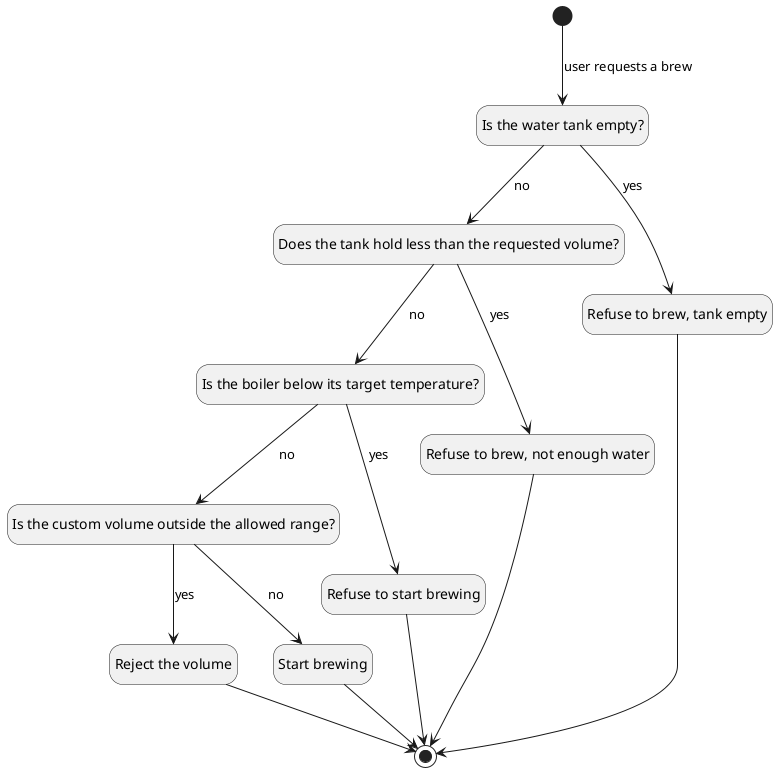

# Refuse to brew with an empty tank

When the user selects espresso and the water tank is empty,
the machine shall refuse to brew.

*Rationale:* dry-running the pump destroys the heating element.

## Decision

